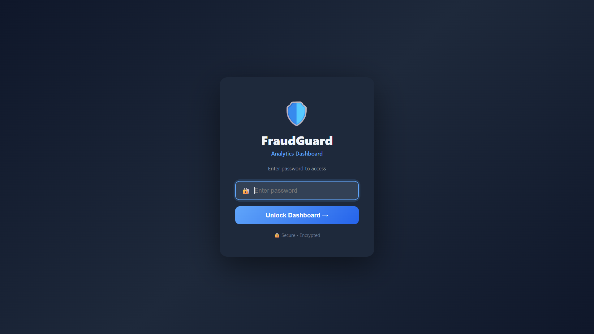
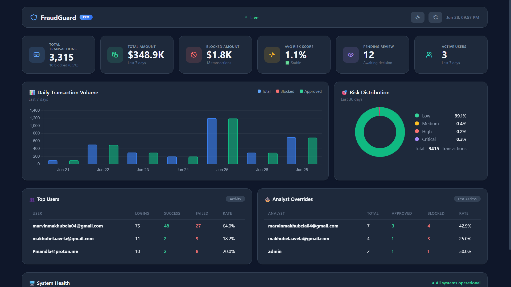

# 🛡️ FraudGuard

> **A real-time fraud detection and transaction monitoring dashboard built with HTML, CSS, JavaScript, and Python.**

FraudGuard provides financial institutions and fraud analysts with an intuitive dashboard for monitoring transaction activity, fraud risk, analyst overrides, and overall system health. Reports are generated automatically using Python and can be deployed as a static website using GitHub Pages.

---

# 📸 Screenshots

## Login Page



---

## Dashboard



---

# ✨ Features

* 📊 Real-time transaction monitoring
* 💳 Transaction volume analytics
* 🚨 Risk distribution visualization
* 👨‍💻 Analyst override tracking
* 👥 User activity monitoring
* ⚡ System health dashboard
* 📈 Interactive charts
* 📁 Automatic report generation
* 🔄 Scheduled report updates
* 🌐 GitHub Pages deployment

---

# 🛠️ Tech Stack

### Frontend

* HTML5
* CSS3
* Vanilla JavaScript
* Chart.js

### Backend

* Python
* JSON

### Deployment & Automation

* GitHub Pages
* GitHub Actions

---

# 📂 Project Structure

```text
FraudGuard/
│
├── .github/
│   └── workflows/
│
├── assets/
│   ├── dashboard.png
│   └── loginPage.png
│
├── css/
│
├── data/
│
├── js/
│
├── reports/
│
├── .gitignore
├── CNAME
├── README.md
├── generate_report.py
├── run_report.py
├── requirements.txt
└── index.html
```

---

# 🚀 Getting Started

Clone the repository

```bash
git clone https://github.com/YOUR_USERNAME/FraudGuard.git
```

Navigate into the project

```bash
cd FraudGuard
```

Install Python dependencies

```bash
pip install -r requirements.txt
```

Generate the latest report

```bash
python run_report.py
```

Run a local server

```bash
python -m http.server 8000
```

Open your browser and visit

```
http://localhost:8000
```

---

# 🔄 Automated Reports

FraudGuard includes automated reporting powered by Python.

The reporting workflow:

* Collects transaction data
* Generates dashboard analytics
* Updates the JSON report file
* Refreshes dashboard statistics

This process can be scheduled using GitHub Actions for continuous updates.

---

# 📊 Dashboard Overview

The dashboard provides real-time insight into:

* Total Transactions
* Total Transaction Value
* Blocked Transactions
* Average Risk Score
* Pending Reviews
* Active Users
* Daily Transaction Volume
* Risk Distribution
* Analyst Overrides
* Top Users
* System Health

---

# 🌍 Deployment

The dashboard can be deployed easily using:

* GitHub Pages
* Render
* Any static web hosting service

---

# 🚀 Future Improvements

* Machine Learning API integration
* User authentication
* Role-based access control
* PDF report generation
* Email notifications
* Live WebSocket updates
* Audit logging

---

# 👨‍💻 Author

**Marvin Vutshila**

Computer Science Student

Fraud Detection & Machine Learning Enthusiast

GitHub: https://github.com/YOUR_USERNAME

---

# 📄 License

This project is licensed under the MIT License.

---

⭐ If you found this project interesting, consider giving it a star.
